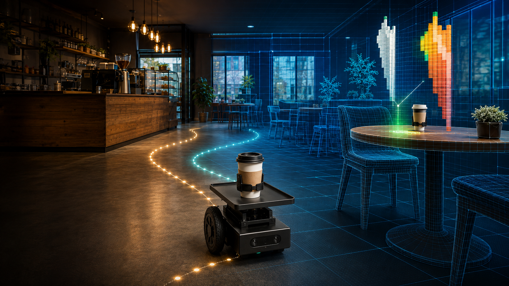
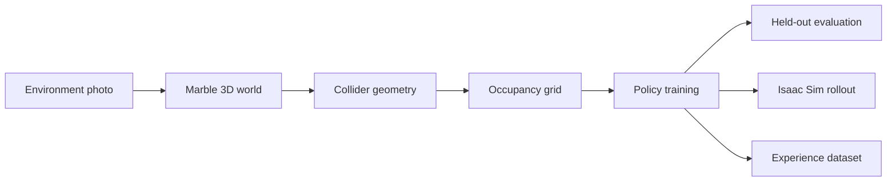

<h1 align="center">World2Work</h1>

  <strong>Turn a photo of your space into a learned robot policy and reusable experience data.</strong>

  World Labs Marble generates the world. World2Work turns its geometry into a navigation environment, 
  learns a site-conditioned policy, evaluates it, and sends the resulting route to Nova Carter in Isaac Sim.

  

  
  
  
  

## From a world to robot experience

Robots entering a new site need an environment, a policy, and evidence that the policy works. Building that setup by hand is slow. World2Work starts with one environment photo and turns it into a reproducible navigation-learning pipeline.

| Generated world | Training | Held-out success | Isaac Sim validation |
|:---:|:---:|:---:|:---:|
| 1 café photo | 4,000 episodes | **5% → 100%** | **0 collisions** |
| Marble world + collider | 94,906 transitions | Random → trained | 366 logged steps |

## Demo scenario

> **Deliver coffee to `table_7` in a café the robot has never been configured for by hand.**

1. **Generate the site** — World Labs Marble reconstructs an explorable café world and exports a fused collider.
2. **Compile it for learning** — World2Work converts the collider geometry into a 35 cm occupancy grid and selects a reachable delivery goal.
3. **Learn from experience** — A four-action tabular Q-learning policy trains for 4,000 episodes and exports state, action, reward, and next-state transitions.
4. **Evaluate the policy** — The same 20 held-out start-cell/orientation configurations compare a fixed-seed random policy with the trained greedy policy.
5. **Run the robot** — NVIDIA Nova Carter executes the learned route in Isaac Sim while robot state is recorded at 10 Hz.

## Results

| Metric | Untrained random | Trained greedy |
|---|---:|---:|
| Success rate | 5% | **100%** |
| Collision-action rate | 21.4076% | **0%** |
| Path efficiency | 0.351351 | **1.0** |

The final Isaac Sim rollout reached the target in **36.4667 seconds**, recorded **366 steps**, and completed with **zero collisions**.

## What is actually learned?

World2Work currently learns a **tabular Q-learning high-level navigation policy** over a grid derived from Marble geometry. It does not claim to train a VLA, GR00T model, or an end-to-end visual controller.

The 20 held-out configurations were excluded as episode starts, but their cells may have been visited during training. The result therefore measures robustness to held-out starting conditions—not unseen-state generalization.

## Honest boundaries

- A Marble collider is a fused static mesh without native object IDs, joints, or semantic labels.
- `table_7` is a reachable goal proxy, not an automatically recognized physical table.
- Marble supplies the visual world and geometry-derived planning context. Stable Carter physics was validated on flat ground with collision proxies.
- The coffee is attached to the robot tray; this demo is navigation, not grasping or manipulation.
- Public redistribution of source imagery requires a venue-owned, licensed, or team-captured photo.

These constraints define the next step: compile generated worlds into richer semantic, interactive robot environments and scale the resulting experience into imitation-learning and VLA-ready datasets.

## Built with

- **World Labs Marble** — image-to-world generation and collider export
- **Python** — geometry processing, grid generation, training, and evaluation
- **NVIDIA Isaac Sim 6.0.1** — Nova Carter execution and telemetry
- **RunPod** — remote Isaac Sim runtime
- **HTML, CSS, and JavaScript** — interactive evaluation dashboard

---

  <strong>Your space → a learned robot policy → reusable robot experience</strong> 
  Built for the Spatial Intelligence + Generative 3D Hackathon.

