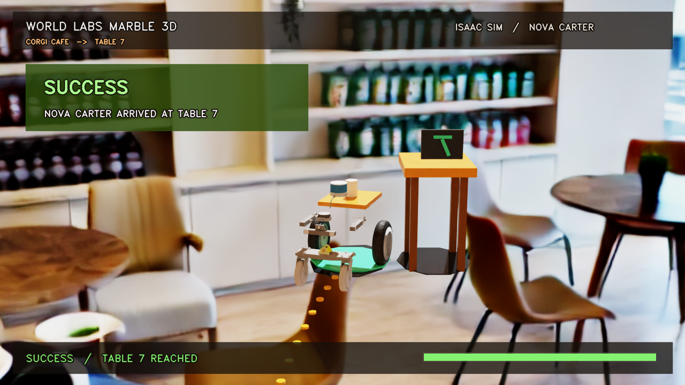
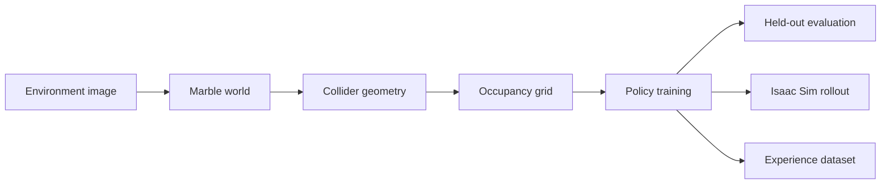

<h1 align="center">World2Work</h1>

<p align="center">
  <strong>Turn a photo of your space into a learned robot policy and reusable experience data.</strong>
</p>

<p align="center">
  World Labs Marble generates the world. World2Work compiles its geometry into a navigation environment,<br />
  trains and evaluates a site-conditioned policy, then executes the route with Nova Carter in Isaac Sim.
</p>

<p align="center">
  <a href="./web-demo/assets/world2work-demo.mp4"><strong>▶ Watch the 30-second demo</strong></a>
  &nbsp;·&nbsp;
  <a href="#run-the-evaluation-dashboard"><strong>Run the evaluation dashboard</strong></a>
  &nbsp;·&nbsp;
  <a href="./docs/worldlabs-capability-audit.md"><strong>Read the capability audit</strong></a>
</p>

<p align="center">
  
  <br />
  <sub>Concept visualization of the World2Work pipeline. The recorded simulator result is shown below.</sub>
</p>

<p align="center">
  
  
  
  
  
</p>

## At a glance

| Input | Generated experience | Held-out evaluation | Simulator validation |
|:---:|:---:|:---:|:---:|
| **1 café image** | **94,906 transitions** | **5% → 100% success** | **Target reached** |
| Marble world + collider | 4,000 Q-learning episodes | Random → trained | 350 logged steps · 7.24 m |

### The problem

Deploying a robot into a new place normally requires a hand-built simulation environment, site-specific training data, and a separate validation workflow. That stack is too expensive for a small venue that wants one robot.

### The result

World2Work turns generated spatial geometry into a reproducible learning environment. For the demo task—**deliver coffee to `table_7`**—it produces a navigation map, policy, held-out evaluation, robot route, and structured episode data.

<p align="center">
  <a href="./web-demo/assets/world2work-demo.mp4">
    
  </a>
  <br />
  <sub><strong>Recorded Isaac Sim result.</strong> Click the image to watch the 30-second demo.</sub>
</p>

## How it works



1. **Generate the site** — World Labs Marble reconstructs an explorable café world and exports a fused collider.
2. **Compile it for learning** — World2Work derives a 35 cm occupancy grid and reachable delivery target from the collider geometry.
3. **Learn from experience** — A four-action tabular Q-learning policy trains for 4,000 episodes and exports state, action, reward, and next-state transitions.
4. **Evaluate the policy** — The same 20 held-out start-cell/orientation configurations compare a fixed-seed random policy with the trained greedy policy.
5. **Run the robot** — NVIDIA Nova Carter follows the exported route in Isaac Sim while its state is recorded at 10 Hz.

## Evaluation

| Metric | Untrained random | Trained greedy |
|---|---:|---:|
| Success rate | 5% | **100%** |
| Invalid-move rate | 21.4076% | **0%** |
| Path efficiency | 0.351351 | **1.0** |

`Invalid-move rate` is the fraction of grid actions that attempt to enter an occupied or out-of-bounds cell. `Path efficiency` is shortest-path steps divided by actual steps, averaged over successful episodes.

The final recorded Isaac Sim episode reached the target in **34.9 seconds**, logged **350 steps**, and traveled **7.24 m**. A separate run with the Marble-derived collider enabled also reached the target over the same route.

## What is actually learned?

World2Work currently learns a **tabular Q-learning high-level navigation policy** over a grid derived from Marble geometry. It does not claim to train a VLA, GR00T model, Unity-style end-to-end agent, or visual controller.

The 20 held-out configurations were excluded as episode starts, but their cells may have been visited during training. The result measures robustness to held-out starting conditions—not unseen-state generalization.

## Run the evaluation dashboard

The dashboard is dependency-free and includes curated copies of the evaluation data and simulator video.

```bash
git clone https://github.com/Sehyeogkim/spatial_intelligence_jeff.git
cd spatial_intelligence_jeff
make demo
```

Open <http://127.0.0.1:4173/web-demo/>.

To validate the public artifacts and script syntax:

```bash
make check
```

## Repository map

```text
.
├── web-demo/       # self-contained evaluation dashboard, data, and video
├── scripts/        # world generation, compilation, training, evaluation, Isaac
├── config/         # reproducible task and render configuration
├── schemas/        # structured robot episode contract
├── docs/           # audit, methodology, pitch, and source attribution
└── assets/readme/  # public repository artwork
```

See [`scripts/README.md`](./scripts/README.md) for the pipeline entry points. Raw World Labs exports, full training logs, and intermediate renders are intentionally excluded from Git and should be distributed as release assets.

## Honest boundaries

- Marble exports a fused static collider without native object IDs, joints, or semantic labels; World2Work derives its own planning and semantic proxies.
- The visual demo uses a panorama backdrop, so café furniture does not occlude the robot as full 3D geometry would.
- The coffee is attached to the robot tray; this is a navigation task, not grasping or manipulation.
- There is no online visual perception in the current controller.
- Public redistribution of source imagery requires a venue-owned, licensed, or team-captured photo.

These boundaries define the next step: compile generated worlds into richer interactive robot environments and scale their experience into imitation-learning and VLA-ready datasets.

## Built with

- **World Labs Marble** — image-to-world generation and collider export
- **Python** — geometry processing, grid generation, training, and evaluation
- **NVIDIA Isaac Sim 6.0.1** — Nova Carter execution and telemetry
- **RunPod** — remote Isaac Sim runtime
- **HTML, CSS, and JavaScript** — interactive evaluation dashboard

---

<p align="center">
  <strong>Your space → a learned robot policy → reusable robot experience</strong><br />
  Built for the Spatial Intelligence + Generative 3D Hackathon.
</p>
